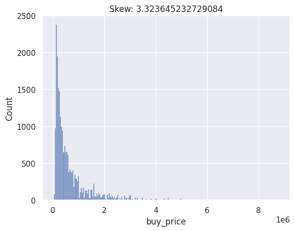
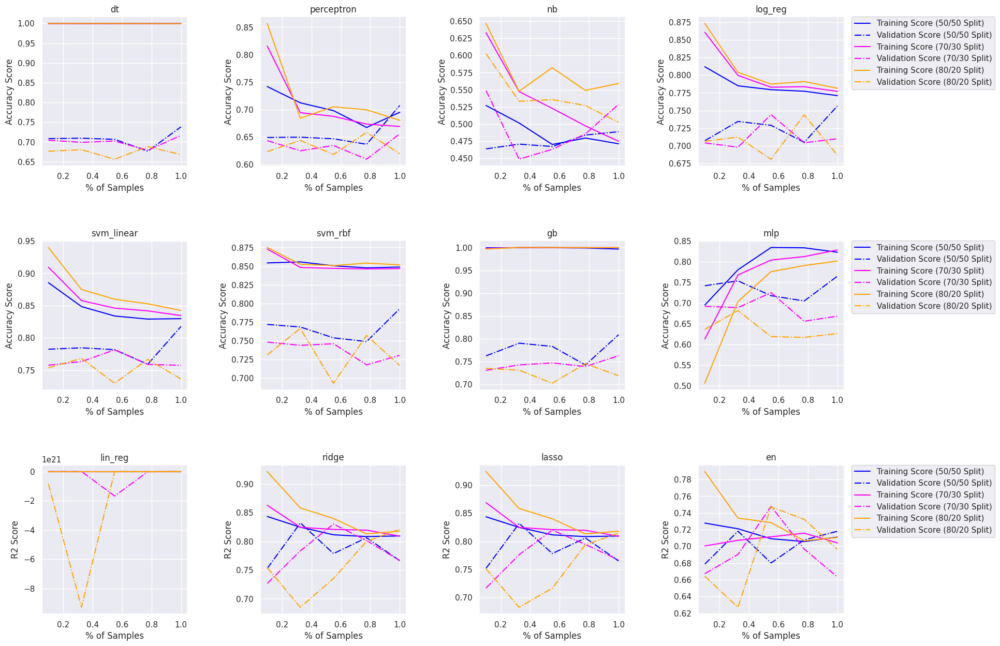
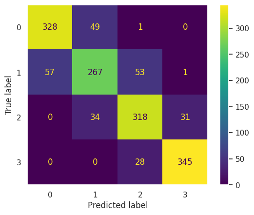

# CSC_4850-MachineLearning-Project

## Predicting Madrid Housing Prices Using Machine Learning Techniques

This project had us use various classification and regression machine
learning algorithms to predict housing prices in Madrid, Spain. A
variety of techniques were used to render the data suitable for
training and testing by all the models used.

# Introduction (Project Idea)

As recent fluctuations in real estate prices have attracted much
attention, efficient ways to analyze the real estate market to predict
housing prices and inform investment decisions is in increasingly high
demand. In this project, we aim to develop and test various machine
learning models to predict housing prices based on various features such
as location, square footage, and amenities. While this is traditionally
framed as a regression problem, several classification models will be
used to make predictions on a discretized version of the housing
dataset. Algorithms discussed in this proposal include linear
regression, support vector machines, gradient boosting, and ridge
regression.

# Survey of Related Work

Linear regression is a popular algorithm used in predicting housing
prices. In their efforts to apply regression methods to predict housing
prices in Islamabad, Pakistan, [1] admits that linear regression is
"used too much" due to its straightforwardness and ease of use, but they
raised several methods as viable alternatives.

## Additional Regression Methods

-   Support Vector Regression (SVR): A variant of Support Vector
    Machines built for regression rather than classification while
    keeping familiar concepts like decision boundaries and support
    vectors.

-   Bayesian Ridge Regression (BRR): A probabilistic model that works
    well with Gaussian distributions. Reference [1] states that it is
    adaptable and able to be fine-tuned through "regularization
    parameters."

-   LassoLars: This is a variant on the Lasso regression model, another
    regularized version of linear regression. Short for least absolute
    shrinkage and selection operator fitted for least-angle regression,
    this model can "reduce model complexity and prevent over-fitting"
    [1]. Its dependency on the data for variable selection was
    alleviated in [1] by combining its penalties with those of BRR.

Reference [1] also mentions other more involved methods for predicting
the housing market, including neural networks and data mining, but that
is beyond the scope of this project. These studies have shown promising
results in predicting housing prices using regression.

In a similar project to predict housing prices in Turkey, [2]
acknowledges the occasional need for kernels to allow data to be
linearly separable in a high-dimensional space. They used support vector
regression as well as decision tree regression to predict their data.
They also believe variables such as the square footage and presence of
amenities do not affect a house's price as strongly as macroeconomic
factors like construction costs, demographic, and unemployment rate
[2].

[3] noted the existence of a nonlinear relationship between housing
prices in Shanghai, China, and air pollution and attempted to identify
explanatory variables using various regression methods, including
ordinary least squares (OLS) linear regression and generalized weighted
regression (GWR). They determined that the data was best predicted using
a gradient boosting decision tree (GBDT) model and concluded that air
pollution has a significant negative impact on housing prices. Their
GBDT model appears to be a regression model.

# Data Source

We used a dataset of real estate listings from Madrid, Spain [3]. This data was collected by scraping various real estate websites that offered housing in Madrid. The dataset has 21,742 samples and 58 features, containing information such as built and useful square footage, number of rooms and bathrooms, address, construction year, and presence of amenities like pools or balconies. Several types of housing are represented here, including apartments, duplexes, and penthouses. The target value to predict is the buy price. 

| **Feature name**    | **Description** |
|----------------------------|--------------------------|
| ID                         | Identifier               |
| title                      | Title from listing       |
| subtitle                   | Neighborhood and city    |
| sq\_mt\_built              | Square meters built      |
| sq\_mt\_useful             | Square meters useful     |
| n\_rooms                   | Number of rooms          |
| n\_bathrooms               | Number of bathrooms      |
| sq\_mt\_allotment          | Square meter allotment   |
| latitude, longitude        | Latitude, Longitude      |
| raw\_address               | Address                  |
| is\_exact\_address\_hidden | Boolean values           |
| price                      | Target Value             |

Fig 1. Distribution of the buy_price target value.

A simple histogram plot of the target value, as shown in Fig. 1, shows that the distribution is skewed to the right. The data does not appear to be normally distributed.

Upon inspection of the data, several problems with the dataset arose:

-   Many of the columns are filled with null or missing values. Some
    columns consisted entirely of null values, while others contained
    either null or TRUE values.

-   Some features correlated too strongly with other features or the
    target value. Namely, "rent_price" could very easily predict
    "buy_price." "parking_price" is consistently null when "has_parking"
    is false and 0.0 when "has_parking" is true.

-   For some reason, some of the samples had more floors than rooms,
    i.e. several of them had four floors but only three rooms. This
    suggested that some of the data was collected erroneously.

To clean and preprocess the dataset simply, we performed the following
operations on the original dataset in sequence:

1.  Remove the following features due to them being empty, nearly empty,
    irrelevant, or too strongly correlated: \"id\", \"title\",
    \"subtitle\", \"operation\", \"latitude\", \"longitude\",
    \"portal\", \"floor\", \"door\", \"rent_price_by_area\",
    \"are_pets_allowed\", \"is_furnished\", \"is_kitchen_equipped\",
    \"has_public_parking\", \"has_private_parking\", \"sq_mt_useful\",
    \"sq_mt_allotment\", \"raw_address\", \"is_exact_address_hidden\",
    \"street_name\", \"street_number\", \"is_rent_price_known\",
    \"is_buy_price_known\", \"is_renewal_needed\",
    \"is_parking_included_in_price\", \"parking_price\", \"rent_price\",
    \"buy_price_by_area\", \"is_orientation_west\",
    \"is_orientation_east\", \"is_orientation_south\",
    \"is_orientation_north\", \"is_floor_under\", \"is_exterior\",
    \"has_lift\".

2.  Delete all the samples that met the following conditions:

    1.  "house_type_id," "built_year," "has_central_heating,"
        "is_new_development," or "sq_mt_built" is null.

    2.  "n_rooms" is 0, implying the home has no rooms.

    3.  "n_rooms" is less than "n_floors," implying the home has more
        floors than rooms.

3.  Delete all the samples that met the following conditions:

    1.  "n_floors": 1

    2.  \"has_ac," "has_garden," "has_pool," "has_terrace,"
        "has_balcony," "has_storage_room," "is_accessible,"
        "has_green_zones" : False

    3.  "n_bathrooms": Median of n_bathrooms

In step 3, "n_floors" was filled in as 1 to assume that most of the
houses, apartments, and penthouses in the dataset will only have one
floor. The Boolean features are all filled in with False because the
fact that True was the only non-null value in all of them suggested that
the dataset's author meant the null values to be interpreted as false.

Additionally, the "neighborhood_id" feature holds strings containing
both a neighborhood ID and a district ID for each sample. To convert the
neighborhood and district information into categorical data for the
models, we split "neighborhood_id" into several dummy variables each
representing a different possible district ID. The "energy_certificate"
and "house_type_id" features also have categorical data represented by a
set of strings, so they were split into more sets of dummy variables.
This process of one-hot encoding the district IDs, energy certificate
IDs, and house types increased the total number of features to 53. We
chose not to create categorical features for neighborhood IDs to keep
the total number of features under 100 and reduce the computational
intensity of the training and testing sessions.

Note that additional preprocessing steps were performed separately on
the training and testing splits of the dataset to avoid influencing the
training set with testing data and vice versa. These include applying
step 3c), which involves calculating a median, and applying a standard
scaler to the non-categorical features. These will be detailed in the
section on implementation.

The final preprocessed dataset had 7,585 samples and 53 features.

# Key Algorithms and Technology

The project was made using a Google Colab notebook supported mainly by
the Matplotlib, Pandas, and scikit-learn libraries. Specifically, all
models and scaling techniques used were imported from the sci-kit learn
library.

Twelve machine learning models were chosen to predict the housing prices
given the data provided. These included both classification and
regression models, and each one benefited from different aspects of the
mix of continuous and categorical data to learn from. During initial
tests of the models, the cross-validation step would fail due to the
classification models' incompatibility with the continuous target value.
To accommodate the classifiers, we introduce a second set yd of target
values derived from the original set. yd is a partitioning of y into
four discrete classes based on the four quantile ranges of y. Both the
training and testing splits of yd are calculated based on the quantile
ranges of the full y set so that the definition of the four classes does
not change when yd is split in different ways.

Additionally, since the classification and regression models have
different metrics that are relevant to them, we separately collected
data on accuracy, precision, recall, and F1-score for classifiers, and
MAE, RMSE, and $R^2$ score for regressors.

In the following descriptions of each model, the term in parentheses is
the key used to identify that model in the following figures and tables.

## Decision Tree (dt)

This classification model works by computing the probability that a
given sample is of a particular class based on the values of all the
other features. It creates decision rules based on which features give
it the most information gain with respect to the target value, and it
represents those rules as additional nodes on the tree. It continues
like this until every \"case\" is accounted for. Predicting new data
with a decision tree involves traversing down the tree based on the
decision each node represents; the decisions get more specific as the
tree gets deeper until a prediction is reached at the end of the branch.
It can handle continuous data by splitting it into numerical ranges that
yield the most information gain. However, computing the minimal decision
tree is NP-hard, and the tree tends to overfit as it gets more complex.
Because it tries to account for every case in the training set, it can
quickly become too complex if it encounters too many statistical
outliers.

## Perceptron

This is a simple classification model that works by dividing the data
into regions based on their class using linear separators. If a class is
mislabeled by the current iteration of the separator, the separator is
adjusted to accommodate the mistake. If not, then the classifier had
converged successfully. To prevent it from overfitting or getting stuck
trying to converge on data that is not linearly separable, the
perceptron can also stop adjusting the separators after a certain number
of iterations.

## Naïve Bayes (nb)

Given a class label, this classification model assumes that all features
are independent of each other. It then computes the conditional
probability of each value of $X$ given the class label $y$ and makes a
prediction based on the method of maximum likelihood. The implementation
used in scikit-learn assumes a Gaussian distribution of the features:

$$P(x_i | y)=\frac{1}{\sqrt{2\pi\sigma_y^2}}\exp{\left(-\frac{(x_i-\mu_y)^2}{2\sigma_y^2}\right)}$$

where $\sigma_y$ and $\mu_y$ are the standard deviation and variance of
the label $y$. This implementation also allows it to predict from
continuous features. While its assumption is almost never true, its good
accuracy and computational efficiency make it popular for initial
predictions of data and comparison with more complex models.

## Logistic Regression (log_reg)

This model classifies data by first computing $P(y|X)$ given a vector
$X$ of features, then converts that probability to a discrete value
using a sigmoid function or similar method. It uses gradient descent to
optimize its weight vector $\theta$ to minimize the cost it incurs due
to its logarithmic cost function. To classify new data, it computes
$h_\theta(x)=\theta^Tx$ and discretizes the result using the activation
function. To configure it to work with multi-class data, we initialized
this model with the \"liblinear\" solver and the one-versus-rest
multi-class setting. This makes it fit a binary classification for each
label, determining if samples are either one class or all other classes.

## Support Vector Machines (svm)

These classifiers, or SVCs, attempt to separate the data with a maximum
margin hyperplane, or a hyperplane such that it is as far away as
possible from any other samples in the feature space. The samples
closest to the hyperplane are known as the support vectors. Two SVCs
will be used in this project, each employing a different kernel to help
separate the data as part of their kernel trick. One uses a linear
kernel that simply computes the dot product of the feature data, while
the other uses the radial basis function (RBF) kernel. The RBF kernel
adds dimensionality to the feature space by representing each data point
as a vector of distances from other data points or centers.

## Gradient Boosting (gb)

Boosting algorithms work by combining the results of many weak learners
to generate stronger learners based on the mistakes of their
predecessors. For the gradient boosting classifier, the weak learners
are regression trees chosen to make decisions that minimize the loss
function. As is true with individual decision trees, smaller trees are
preferred to help with generalization. The gradient boosting algorithm
uses gradient descent to iteratively add trees and gradually approach a
satisfactory accuracy score at a rate determined by the learning rate
hyperparameter. One of the issues with gradient boosting is that it has
a tendency to ascribe higher importance to numerically larger values.
This can be mitigated using feature scaling. For this project, the
histogram gradient boosting classifier available in scikit-learn was
used for its faster performance on large datasets. It was initialized
with the default parameters, so its learning rate was 0.1, the maximum
number of leaf nodes was 31, and it did not have any regularization
applied to it.

## Multi-Layer Perceptron (mlp)

This is a neural network comprised of several layers of perceptrons.
Each perceptron acts as a neuron that takes several weighted inputs and
returns an output through an activation function. The perceptrons
receiving the input directly feed that input into one or more hidden
layers of perceptrons that continue to process the inputs until they
reach the output layer, which then outputs the final prediction. The MLP
classifier used for this project has been set up to do 100 maximum
iterations with the 'adam' solver and using early stopping to stop
training prematurely when the validation score is not improving. The
'adam' solver is an optimizer based on stochastic gradient descent,
which involves having the network work through one data sample at a time
and comparing its output to the expected output. It then propagates the
calculated error from the output back through the network to reweight
the neurons based on how much they contributed to the error.

## Linear Regression (lin_reg)

This is a simple regression model that tries to fit a line or hyperplane
through a set of data points. Given a feature set $x$ predicting another
value $y$, the model tries to find the weight vector $w_1$ and
$y$-intercept $w_0$ in the linear equation $y = w_0 + w_1x$. To work
effectively, it assumes that the target value $y$ has a linear
relationship with the input data $X$; $y$ follows a normal distribution
and has the same variance at each value of $X$; and all observations are
independent. It optimizes $w$ by minimizing a loss function defined on
the training data, so it risks not being able to generalize well on the
testing set. This can be remedied by adding a penalty term to the
model's loss function, making it harder to optimize. The version of this
model in scikit-learn uses a loss function that calculates the residual
sum of squares between the features in the dataset:

$$L(w)=\sum_{n=1}^{N}(y_n-w^Tx_n)^2$$

This particular loss function has an easy solution to determine the
optimal value of $w$:

$$w=(X^TX)^{-1}X^Ty$$

## Ridge

Additional regularization functions can be added onto the linear
regression model's loss function to reduce overfitting. By adding the
squared Euclidean norm of $w$ to $L(w)$, we get the loss function for
Ridge regression:

$$L_{reg}(w) = \sum_{n=1}^{N}(y_n-w^Tx_n)^2 + \lambda{w^Tw}$$

Increasing the value of $\lambda$ increases the strength of the
regularization, reducing the variance of the coefficients $w$. This
technique is also known as $l2$ regularization.

## Lasso

This is an alternative method of regularizing a linear regression model
that uses $l1$ regularization instead. Its loss function equation is:

$$L_{reg}(w) = \sum_{n=1}^{N}(y_n-w^Tx_n)^2 + \lambda{|w|}$$

This has the effect of penalizing the coefficients of less important
features more strongly, eventually bringing their weights to zero and
eliminating them from the rest of the regression process. It is
particularly effective on datasets with small numbers of features and
correlated data.

## Elastic Net (en)

This regression model combines the feature-selecting capability of Lasso
with the variance reduction of Ridge by using both $l1$ and $l2$
regularization in its loss function:

$$L_{reg}(w) = \sum_{n=1}^{N}(y_n-w^Tx_n)^2 + \lambda\rho{|w|} + \frac{\lambda(1-\rho)}{2}w^Tw$$

where $\rho$ is the ratio between the $l1$ and $l2$ terms. One
particular advantage of Elastic Net is its ability to choose multiple
features that are correlated with each other; Lasso will usually just
pick one and eliminate the other.

# Implementation

To provide replicable results, all models and functions were initialized
or called with a random state of 1234 where applicable.

All models were evaluated on their performance on three different
distributions of the dataset, which reserved 50%, 70%, and 80% of the
data respectively for training.

While the collection of algorithms here include both classifiers and
regressors, the target value is a continuous value that is only
compatible with regression. To accommodate the classifiers, we introduce
a second set $y_d$ of target values derived from the original set. $y_d$
is a partitioning of $y$ into four discrete classes based on the four
quantile ranges of $y$. Both the training and testing splits of $y_d$
are calculated based on the quantile ranges of the full $y$ set so that
the definition of the four classes does not change when yd is split in
different ways.

The models were trained and tested in two separate batches:
classification on $y_d$ and regression on $y$. During training, each
model was cross-validated on ten folds of the training set. The
cross-validation process yielded ten instances of the model trained on
each of the ten folds. These instances were recorded along with their
respective metrics: accuracy, precision, recall, and F1 score for
classification; RMSE, MAE, and $R^2$ score for regression. After the
cross-validation, the best estimator of those ten was chosen based on
which one had the highest accuracy or $R^2$ score. This yields one
\"best\" instance for each of the models.

For testing, each model was fit on the whole training set, then set to
predict the testing data. Afterwards, we collected more cross-validated
training and testing scores on five different folds and at five
different sizes of the whole testing set. This would be used to generate
learning curves for each model. We also collected each model's
permutation importances for each feature based on the whole testing set.
Both learning curve and importance data were collected based on accuracy
score for classifiers and $R^2$ score for regression models.

To summarize, the steps to train and test all the models are as follows:

1.  Split the features $X$ and target values $y$ into X_train, X_test,
    y_train, and y_test.

2.  Perform the last data preprocessing steps and feature scaling on
    X_train and X_test.

3.  Get y_train_d and y_test_d by binning y_train and y_test by the
    quantile ranges of y.

4.  Train all the classifiers on 10 folds of y_train_d, collecting each
    of the 10 instances' evaluation metrics and selecting the best
    instance of each classifier by comparing their testing scores.

5.  Repeat step 3 with the regressors on folds of y_train.

6.  Test the best classifiers on y_test_d, collecting their learning
    curve scores, predicted y values, and the permutation importances of
    each feature for each model.

7.  Repeat step 6 with the regressors on y_test.

8.  Repeat all previous steps for each of the 3 training/testing splits:
    50/50, 70/30, and 80/20.

9.  Return all of the collected data for further analysis.

# Results

Once we've finished training and testing all the models, we now have the
following information for each of the three training/testing splits:

-   Copies of each of the 10 instances of the 12 models with their
    respective evaluation metrics.

    -   Accuracy, precision, recall, and F1 score for classifiers, and
        MAE, RMSE, and $R^2$ score for regressors.

-   The 12 model instances with the highest training scores, one for
    each model.

    -   Scores are accuracy for classifiers and $R^2$ for regressors.

-   The training and testing scores of the 12 best models.

-   The learning curve data from the 12 best models on the testing sets,
    containing 5 sample sizes, training scores, and validation scores.

-   The predictions for y made by the 12 best models from the testing
    sets.

-   The mean, standard deviation, and raw permutation importances of
    each feature in X for the 12 best models.

-   Copies of y_test and y_test_d.

Most of the data was stored in arrays of three Python dictionaries, one
for each training/testing distribution. The dictionaries were arranged
by model key, so iterating through the data structures usually involved
a nested loop iterating first by sample size and then by model key.

Fig 2. Learning curve data.

## Learning Curves

Fig. [\[lc\]](#lc){reference-type="ref" reference="lc"} shows the
learning curve data for each of the twelve models. The solid lines
indicate the training scores for each of the models, and the dashed
lines represent the validation scores. This information reveals several
facts about the best-performing models:

-   The tree-based Decision Tree and Gradient Boosting classifiers both
    overfitted the most, with near-perfect accuracy on the training set
    and much worse performance on the validation set.

-   The MLP's ability to generalize tends to worsen as the number of
    samples increases, as shown by the increasing gap between the
    training and validation score with percentage of samples.

-   The linear regression model acted erratically compared to the other
    three regression models.

-   The Ridge, Lasso, and ElasticNet models appeared to have generalized
    the best, showing the smallest gaps in training and validation score
    compared to all other models. However, the logistic regression and
    SVM linear models also generalize when trained on the whole training
    split in the 50/50 case.

## Individual Model Performance

All the relevant metrics for the ten instances of each model has been
recorded in a set of 36 tables; that is, one table for each of the
twelve model types for each of the three distributions.
The below table is one of
these tables, showing the performance of the decision tree classifier on
ten different folds of the 50% split of the training set. The rest of
the tables can be found in the Colab notebook and in the report.

|         | **dt 1** | **dt 2** | **dt 3** | **dt 4** | **dt 5** | **dt 6** | **dt 7** | **dt 8** | **dt 9** | **dt 10** |
|-----------|----------|----------|----------|----------|----------|----------|----------|----------|----------|-----------|
| Precision | 0.7207   | 0.7564   | 0.7225   | 0.7495   | 0.7251   | 0.7850   | 0.7712   | 0.7466   | 0.7395   | 0.7671    |
| Recall    | 0.7166   | 0.7488   | 0.7241   | 0.7510   | 0.7222   | 0.7856   | 0.7726   | 0.7486   | 0.7320   | 0.7666    |
| F1        | 0.7182   | 0.7500   | 0.7223   | 0.7500   | 0.7233   | 0.7843   | 0.7713   | 0.7472   | 0.7345   | 0.7656    |
| Accuracy  | 0.7169   | 0.7487   | 0.7249   | 0.7513   | 0.7222   | 0.7857   | 0.7725   | 0.7487   | 0.7321   | 0.7666    |

## The Best Model

Given all the metrics data collected, the best model was found with the
following procedure:

1.  For each of the three training/testing splits, iterate through each
    dictionary of training/testing scores to find the model with the
    highest testing score in that split. Store that model's key and
    score. This gives us the best model from each split.

2.  Compare the three best models' testing scores to find the most
    performant model out of all the splits.

The results of the decision process is shown in
Table 3. The best model
was the Histogram Gradient Boosting Classifier from the 80/20 split. The
column \"Training Metrics\" refers to the model's performance on the
validation fold during training, and the \"Testing Metrics\" column
shows the model's performance on the full testing set. While its
performance on the testing set was not as good as its performance on the
validation set during training, it still did better than all other
models in the experiment.

|           | **Training Metrics** | **Testing Metrics** |
|-----------|----------------------|---------------------|
| Sample    | 80/20                |                     |
| Model     | Gradient Boosting    |                     |
| accuracy  | 0.85596              | 0.832011            |
| recall    | 0.855901             | 0.831231            |
| precision | 0.856695             | 0.832324            |
| F1        | 0.856086             | 0.831385            |

Fig. 3. Confusion matrix for the best model.

Fig. 3 shows the confusion
matrix for this model. The higher number of true positives for classes 0
and 3 indicate that the model performed better on samples with target
values further away from the median.

## Metrics for each of the best models

| 50/50 Split | **Precision/RMSE** | **Recall/MAE** | **F1/$R^2$** | **Accuracy** |
|-------------|--------------------|----------------|--------------|--------------|
| dt          | 0.7452             | 0.7445         | 0.7448       | 0.7441       |
| perceptron  | 0.6522             | 0.6696         | 0.6580       | 0.6687       |
| nb          | 0.5483             | 0.4685         | 0.4066       | 0.4668       |
| log\_reg    | 0.7490             | 0.7505         | 0.7467       | 0.7502       |
| svm\_linear | 0.8150             | 0.8114         | 0.8126       | 0.8113       |
| svm\_rbf    | 0.8095             | 0.8030         | 0.8052       | 0.8029       |
| gb          | 0.8237             | 0.8229         | 0.8233       | 0.8227       |
| mlp         | 0.8041             | 0.7992         | 0.8008       | 0.7992       |
| lin\_reg    | 316029.6630        | 172252.0492    | 0.8033       | NaN          |
| ridge       | 316034.1626        | 172170.2392    | 0.8033       | NaN          |
| lasso       | 316029.3174        | 172252.4907    | 0.8033       | NaN          |
| en          | 382798.0277        | 204297.3976    | 0.7114       | NaN          |
| 70/30 Split | Precision/RMSE     | Recall/MAE     | F1/$R^2$     | Accuracy     |
| dt          | 0.7475             | 0.7473         | 0.7473       | 0.7469       |
| perceptron  | 0.6552             | 0.6316         | 0.6145       | 0.6318       |
| nb          | 0.5389             | 0.4656         | 0.4031       | 0.4638       |
| log\_reg    | 0.7516             | 0.7548         | 0.7503       | 0.7544       |
| svm\_linear | 0.8209             | 0.8185         | 0.8194       | 0.8183       |
| svm\_rbf    | 0.8177             | 0.8110         | 0.8133       | 0.8108       |
| gb          | 0.8284             | 0.8278         | 0.8281       | 0.8276       |
| mlp         | 0.8184             | 0.8173         | 0.8178       | 0.8170       |
| lin\_reg    | 316843.0957        | 170777.8673    | 0.7991       | NaN          |
| ridge       | 316849.2731        | 170715.6205    | 0.7991       | NaN          |
| lasso       | 316834.8586        | 170777.2300    | 0.7992       | NaN          |
| en          | 384486.0446        | 202117.1277    | 0.7042       | NaN          |
| 80/20 Split | Precision/RMSE     | Recall/MAE     | F1/$R^2$     | Accuracy     |
| dt          | 0.7771             | 0.7769         | 0.7769       | 0.7765       |
| perceptron  | 0.6802             | 0.6765         | 0.6652       | 0.6746       |
| nb          | 0.5419             | 0.4627         | 0.4001       | 0.4597       |
| log\_reg    | 0.7550             | 0.7571         | 0.7519       | 0.7566       |
| svm\_linear | 0.8139             | 0.8124         | 0.8129       | 0.8122       |
| svm\_rbf    | 0.8184             | 0.8164         | 0.8173       | 0.8161       |
| gb          | 0.8312             | 0.8323         | 0.8314       | 0.8320       |
| mlp         | 0.8167             | 0.8187         | 0.8173       | 0.8181       |
| lin\_reg    | 306900.7081        | 170024.1118    | 0.8032       | NaN          |
| ridge       | 306909.9984        | 169980.3990    | 0.8032       | NaN          |
| lasso       | 306900.1995        | 170035.0854    | 0.8032       | NaN          |
| en          | 369914.3016        | 198599.8068    | 0.7141       | NaN          |

Table IV shows the relevant evaluation metrics for the best iterations of each
model on the three sampling distributions. This table reveals the
following facts about the experiment:

-   The perceptron and Naive Bayes models easily performed the worst
    overall. Their metrics just do not compare to all the other models.

-   By contrast, more complex models like the GB classifier, MLP, Ridge,
    and Lasso models showed better results in terms of accuracy or $R^2$
    score. In this case, the more sophisticated models showed a
    significant enough improvement in performance to justify their usage
    over simpler alternatives.

-   Despite its strange readings for $R^2$ score in the learning curves
    tables, the linear regression model's metrics appear to be normal
    compared to the other regression models.

## Feature importances for each of the best models

| **50/50 Split Model**   | **Feature**        | **Mean Importance** |
|-------------|--------------------|---------------------|
| dt          | sq\_mt\_built      | 0.346388            |
| perceptron  | sq\_mt\_built      | 0.227097            |
| nb          | district\_id\_3    | 0.055835            |
| log\_reg    | sq\_mt\_built      | 0.270971            |
| svm\_linear | sq\_mt\_built      | 0.352527            |
| svm\_rbf    | sq\_mt\_built      | 0.231331            |
| gb          | sq\_mt\_built      | 0.402858            |
| mlp         | sq\_mt\_built      | 0.238793            |
| lin\_reg    | house\_type\_id\_1 | 1.1521e20           |
| ridge       | sq\_mt\_built      | 1.474503            |
| lasso       | sq\_mt\_built      | 1.4763              |
| en          | sq\_mt\_built      | 0.430039            |
| **70/30 Split Model**   | **Feature**        | **Mean Importance**     |
| dt          | sq\_mt\_built      | 0.365168            |
| perceptron  | sq\_mt\_built      | 0.218783            |
| nb          | district\_id\_3    | 0.059612            |
| log\_reg    | sq\_mt\_built      | 0.281217            |
| svm\_linear | sq\_mt\_built      | 0.37134             |
| svm\_rbf    | sq\_mt\_built      | 0.248236            |
| gb          | sq\_mt\_built      | 0.406349            |
| mlp         | sq\_mt\_built      | 0.315697            |
| lin\_reg    | house\_type\_id\_1 | 2.2913e22           |
| ridge       | sq\_mt\_built      | 1.456495            |
| lasso       | sq\_mt\_built      | 1.457754            |
| en          | sq\_mt\_built      | 0.42364             |
| **80/20 Split Model**   | **Feature**        | **Mean Importance** |
| dt          | sq\_mt\_built      | 0.370503            |
| perceptron  | sq\_mt\_built      | 0.270106            |
| nb          | district\_id\_3    | 0.056481            |
| log\_reg    | sq\_mt\_built      | 0.283201            |
| svm\_linear | sq\_mt\_built      | 0.363492            |
| svm\_rbf    | sq\_mt\_built      | 0.260714            |
| gb          | sq\_mt\_built      | 0.413228            |
| mlp         | sq\_mt\_built      | 0.297487            |
| lin\_reg    | house\_type\_id\_1 | 7.8272e21           |
| ridge       | sq\_mt\_built      | 1.52112             |
| lasso       | sq\_mt\_built      | 1.522347            |
| en          | sq\_mt\_built      | 0.432158            |

Table 5 shows the
features that yielded the highest feature importance for each of the
models in each sample distribution. The table revealed the following
additional information:

-   The most important feature is almost unanimously the number of built
    square meters.

-   The only outliers are \"district_id_3\" for the Naive Bayes
    classifier and \"house_type_id_1\" for the linear regression model.
    In the case of the Naive Bayes classifier, even the most important
    feature was the least helpful to it compared to other models. For
    the linear regression model, the mean importances for many of the
    categorical features were extremely high compared to all other data,
    suggesting a major mistake was made by using the model in such a
    way.

Table 6 is
given to show that the linear regression model behaved the way it did on
many categorical features. Seeing that this is the only regression model
that was not regularized, this suggests that the regularized nature of
the Ridge, Lasso, and Elastic Net models significantly affected how they
weighted their features. Even so,
Table 4
shows that the linear regression model performed about as well as the
other regression models.

| **50/50 Split Model**      | **District** | **Importance** | **House Type** | **Importance** | **Energy Cert** | **Importance** |
|-------------|--------------|----------------|----------------|----------------|-----------------|----------------|
| dt          | 3            | 0.029108       | 1              | 0.004446       | no indicado     | 0.001588       |
| perceptron  | 6            | 0.026144       | 5              | 0.003652       | A               | 0.001164       |
| nb          | 3            | 0.055835       | 2              | 0.008256       | B               | 0.002117       |
| log\_reg    | 4            | 0.042233       | 5              | 0.001588       | F               | 0.0009         |
| svm\_linear | 4            | 0.057687       | 5              | 0.005716       | F               | 0.001746       |
| svm\_rbf    | 4            | 0.025351       | 5              | 0.000794       | B               | 0.001058       |
| gb          | 3            | 0.030431       | 5              | 0.002964       | no indicado     | 0.001905       |
| mlp         | 4            | 0.044403       | 5              | 0.004075       | en trámite      | 0.002435       |
| lin\_reg    | 4            | 8.9703e18      | 1              | 1.1521e20      | en trámite      | 1.7069e18      |
| ridge       | 5            | 0.028482       | 2              | 0.001808       | C               | 0.000653       |
| lasso       | 5            | 0.029798       | 1              | 0.005357       | C               | 0.00079        |
| en          | 5            | 0.005871       | 1              | 0.001033       | C               | 0.00025        |
| **70/30 Split Model**   | **District** | **Importance** | **House Type** | **Importance** | **Energy Cert** | **Importance** |
| dt          | 13           | 0.032804       | 5              | 0.002734       | no indicado     | 0.003439       |
| perceptron  | 4            | 0.030071       | 5              | 0.004145       | C               | 0.001058       |
| nb          | 3            | 0.059612       | 5              | 0.006526       | B               | 0.002822       |
| log\_reg    | 4            | 0.045944       | 5              | 0.001235       | A               | 0.001852       |
| svm\_linear | 4            | 0.066667       | 5              | 0.005644       | B               | 0.001852       |
| svm\_rbf    | 5            | 0.02963        | 5              | 0.003263       | en trámite      | 0.002293       |
| gb          | 3            | 0.027249       | 1              | 0.004762       | en trámite      | 0.002205       |
| mlp         | 4            | 0.056878       | 5              | 0.003439       | en trámite      | 0.006526       |
| lin\_reg    | 4            | 5.2736e17      | 1              | 2.2913e22      | en trámite      | 3.3972e20      |
| ridge       | 5            | 0.028481       | 2              | 0.003754       | C               | 0.000712       |
| lasso       | 5            | 0.029129       | 1              | 0.006993       | C               | 0.001035       |
| en          | 5            | 0.005787       | 1              | 0.000827       | C               | 0.000291       |
| **80/20 Split Model**   | **District** | **Importance** | **House Type** | **Importance** | **Energy Cert** | **Importance** |
| dt          | 5            | 0.027513       | 1              | 0.005688       | E               | 0.004497       |
| perceptron  | 4            | 0.031878       | 5              | 0.003571       | A               | 0.002646       |
| nb          | 3            | 0.056481       | 5              | 0.005952       | B               | 0.002116       |
| log\_reg    | 4            | 0.042063       | 2              | 0.002249       | en trámite      | 0.004365       |
| svm\_linear | 4            | 0.056878       | 5              | 0.00463        | C               | 0.001852       |
| svm\_rbf    | 4            | 0.029233       | 5              | 0.004497       | B               | 0.001852       |
| gb          | 3            | 0.02963        | 5              | 0.004894       | C               | 0.002116       |
| mlp         | 4            | 0.050265       | 5              | 0.006217       | D               | 0.003704       |
| lin\_reg    | 4            | 6.1420e16      | 1              | 7.8272e21      | en trámite      | 1.9239e19      |
| ridge       | 5            | 0.028664       | 2              | 0.003304       | C               | 0.000733       |
| lasso       | 5            | 0.02959        | 1              | 0.008082       | C               | 0.001062       |
| en          | 5            | 0.005827       | 1              | 0.000652       | C               | 0.000299       |

# Conclusion

As was shown earlier, the most performant model was the Histogram
Gradient Boosting Classifier on the 80/20 split. In fact, the GB
classifier was consistently the best-performing classifier on all three
splits. We initially thought that this performance was due to the large
number of categorical features, but the table of most important features
suggests otherwise. Instead, it shows that the GB classifier
consistently derived more importance from the already prominent
sq_mt_built feature compared to the other classifiers. the model's
resistance to outliers and ability to recognize non-linear relationships
in the data helped it outperform the other models. The model trained on
the 80/20 split specifically performed better because the gradient
boosting algorithm works better on large datasets. That being said, the
80/20 GB classifier did generalize worse than the other two GB
classifiers, as was shown in Fig. 2.

The Ridge, Lasso, and Elastic Net models all generalized better than the
classifiers. Their training scores were consistently the closest to the
validation scores when evaluated on the full testing set. The only
classifiers that came close to their performance were the logistic
regression and linear SVM classifiers, but only on the 50/50 splits. The
Elastic Net model scored worse compared to the other two because its
high learning rate made it frequently overestimate the optimal
coefficients for the hyperplane. This can be seen in
Fig. 2 by observing how
the Elastic Net's learning curves are more jagged compared to the Ridge
and Lasso's curves.

While more of the models generalized better on the 50/50 split, they
generally got more accurate on the 80/20 split. Even so, only a few
models had their performance significantly affected by the data
distribution. Those would include the decision tree, perceptron, and GB
models.

There were several adjustments that could have been made to improve the
results here. Many of the models were initialized with the default
parameters from scikit-learn, and the changes that were made to the
parameters were done so in interest of computational efficiency, not
necessarily better model performance. One such example is setting
\"early_stopping\" on the MLP classifier. Given more time and resources,
all the available hyperparameters could have been adjusted for optimal
performance, ideally by using methods such as grid search. Additionally,
the Lasso model's objective function failed to converge every time the
model was trained. Despite our best efforts to promote convergence, it
still was not able to do so. Further investigation would need to go into
both the regularization scaling, number of iterations, and feature
scaling to make it so the Lasso model actually does converge.

The evaluation of the best models in each sampling distribution and the
selection of the all-time best model both also make assumptions for
simplicity. Namely, the \"best model\" has been defined as the model
that has the highest testing accuracy or $R^2$ score. In this way, other
important metrics such as RMSE, precision or recall have deliberately
been ignored in the decision process. Furthermore, the final
calculations for precision, recall, and F1 score for all the best models
have been done using macro averaging. When these calculations are done
with micro averaging instead, all three of these classification metrics
are equal to the accuracy score. Table  7, showing the classification metrics for the best
classifiers on the 80/20 split with micro averaging, is shown to
demonstrate this. The scikit-learn documentation says this averaging
technique works by \"counting the total true positives, false negatives
and false positives,\" which implies that each of these models all
yielded as many false positives as they did false negatives. This seems
highly unlikely, which is why we chose a different averaging method.

|             | **Precision** | **Recall** | **F1** | **Accuracy** |
|-------------|---------------|------------|--------|--------------|
| dt          | 0.7765        | 0.7765     | 0.7765 | 0.7765       |
| perceptron  | 0.6746        | 0.6746     | 0.6746 | 0.6746       |
| nb          | 0.4597        | 0.4597     | 0.4597 | 0.4597       |
| log\_reg    | 0.7566        | 0.7566     | 0.7566 | 0.7566       |
| svm\_linear | 0.8122        | 0.8122     | 0.8122 | 0.8122       |
| svm\_rbf    | 0.8161        | 0.8161     | 0.8161 | 0.8161       |
| gb          | 0.8320        | 0.8320     | 0.8320 | 0.8320       |
| mlp         | 0.8181        | 0.8181     | 0.8181 | 0.8181       |

Lastly, changes to the dataset itself also influenced the outcome of
this experiment. Most notably, the decision to convert the problem into
a multi-class classification problem for the classifiers introduced
conditions that favored models like GB that favor multi-class
environments. We could have generated only two classes for prices below
and above the median to make the problem easier for binary
classification models like logistic regression, but the resulting
predictions would not be as useful. we could have also generated more
classes based on more percentile ranges to get more specific
predictions, but those predictions would be less likely to be accurate,
and the resulting computational intensity could have reached unfeasible
levels. We encountered a similar issue when considering whether to
include categorical data for neighborhood IDs. Doing so would have given
the final dataset over 100 features, drastically increasing the time and
resources needed to finish evaluating all the models.

# References
I. Imran, Z. Umar, W. Muhammad, and Z. Atif, "Using Machine Learning
Algorithms for Housing Price Prediction: The Case of Islamabad Housing
Data," Soft Computing and Machine Intelligence, vol. 1, no. 1, pp.
11---23, Jun. 2021. 

M. Kayakuş, M. Terzioğlu, and F. Yetiz, "Forecasting
housing prices in Turkey by machine learning methods," Aestimum, vol.
80, pp. 33--44, 2022. 

G. Zou, Z. Lai, Y. Li, X. Liu, and W. Li,
"Exploring the nonlinear impact of air pollution on housing prices: A
machine learning approach," Economics of Transportation, vol. 31, art.
100272, Jun. 2022. 

M. Toktogaraev and M. Barra, \"Madrid real estate
market \[Dataset\],\" 2020. \[Online\]. Available:
https://www.kaggle.com/datasets/mirbektoktogaraev/madrid-real-estate-market.
\[Accessed 7 3 2023\].
